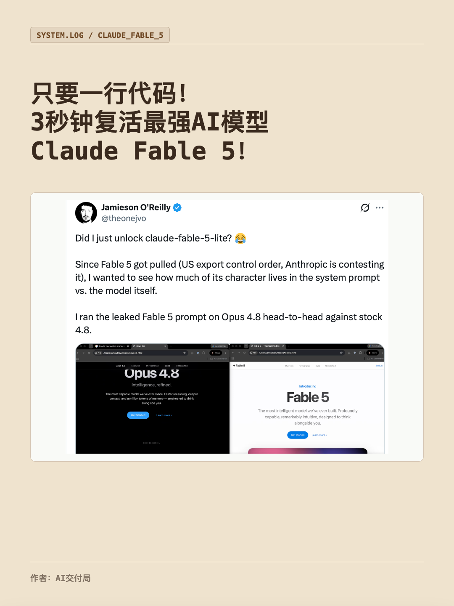
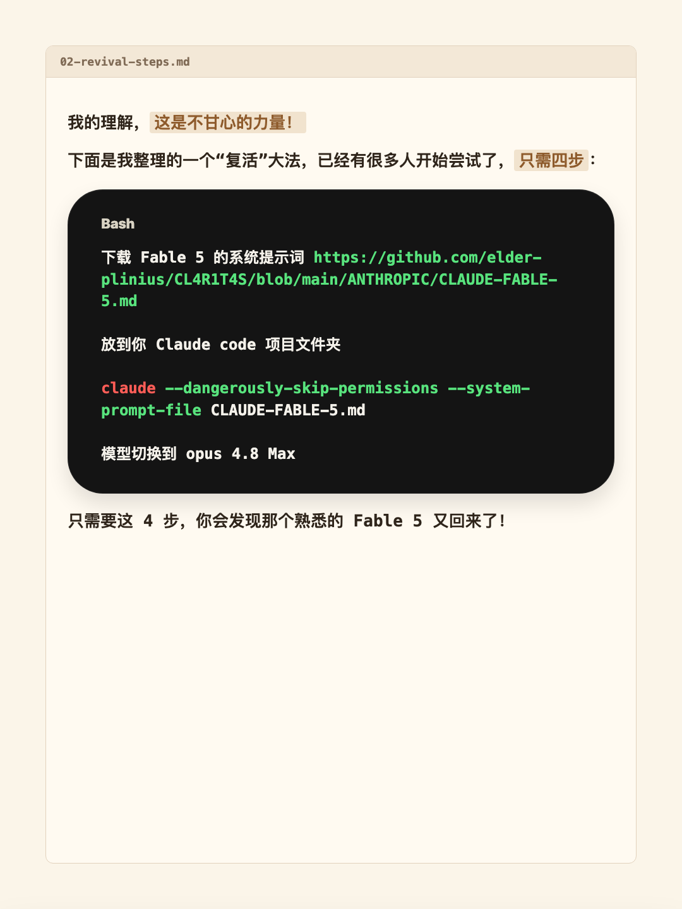
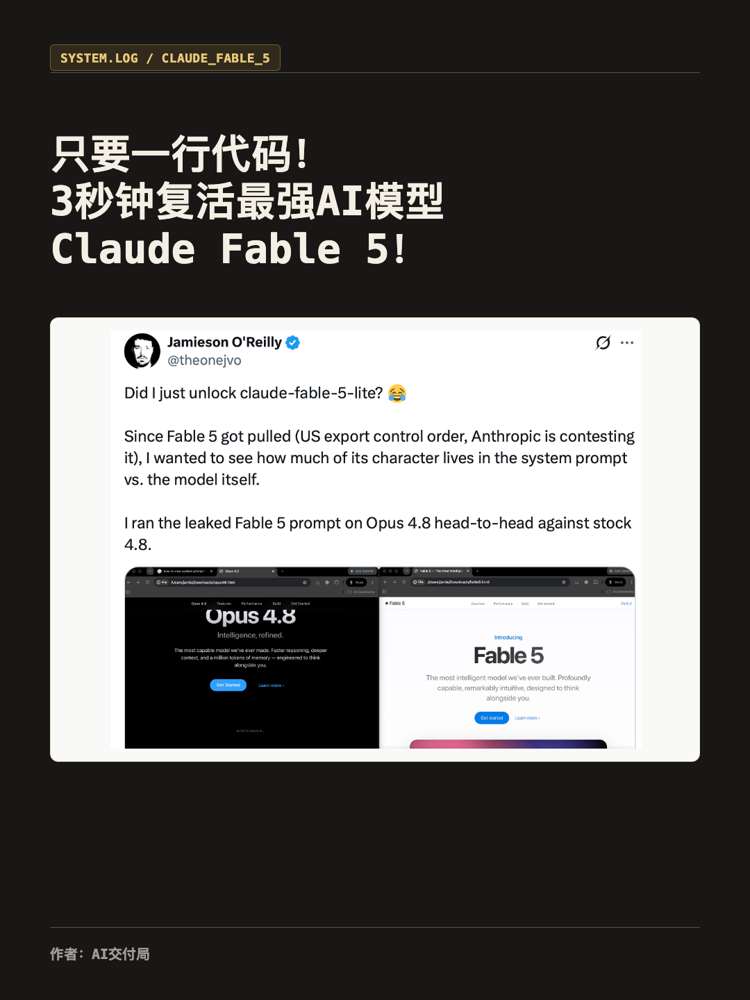
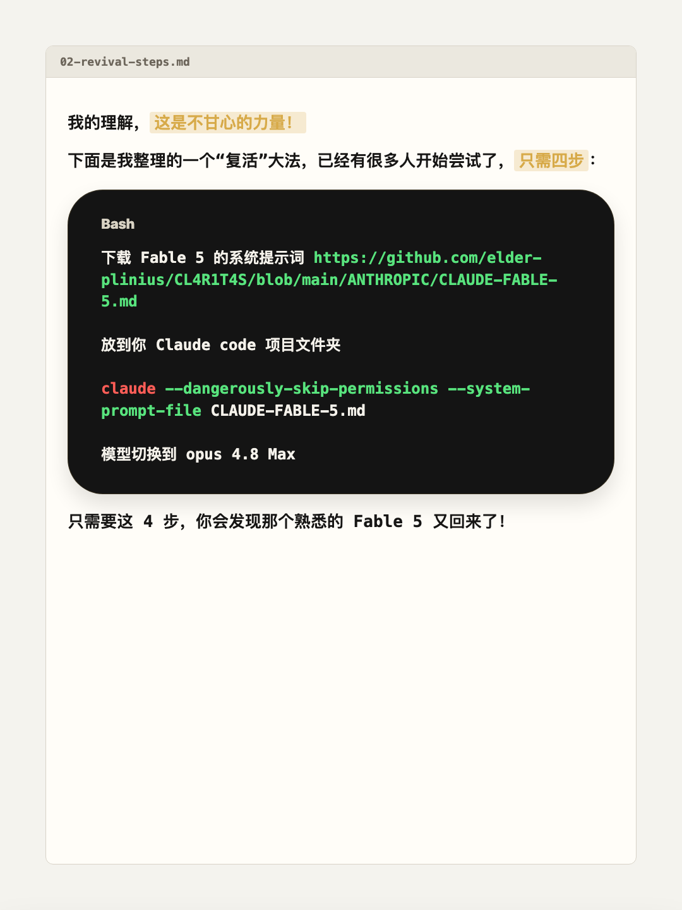

# AI 交付局图文Plog生成器

把 Markdown、Word/docx、文章内容和配图，自动排版为适合小红书发布的 3:4 图文 PLOG。

这个仓库包含一个 Codex Skill：`xhs-markdown-plog`。它会根据你给的标题、正文和图片素材，生成封面页、正文页、预览 HTML，并导出发布用 PNG 图片。

## 效果预览

### 书面阅读感

| 封面 | 正文 |
| --- | --- |
|  |  |

### 专业黑金

| 封面 | 正文 |
| --- | --- |
|  |  |

## 能做什么

- 把一篇 Markdown 文章变成小红书图文 PLOG。
- 把带配图的 Word/docx 内容排版为 PLOG。
- 把你直接发来的文字和图片素材排版为 PLOG。
- 自动生成第一页封面，后续页面排正文、图片、原文重点高亮和代码块。
- 支持两种固定风格：`书面阅读感`、`专业黑金`。
- 代码块使用深色大圆角样式，并对命令、路径、参数做颜色高亮。

默认画幅为 `1080 × 1440`，比例 `3:4`，适合小红书图文发布。

## 安装

先克隆仓库，再把 skill 复制到 Codex skills 目录：

```bash
git clone https://github.com/X-hub-spec/ai-jiaofuju-plog-generator.git
cd ai-jiaofuju-plog-generator
mkdir -p ~/.codex/skills
cp -R xhs-markdown-plog ~/.codex/skills/
```

安装后，在 Codex 里说“用 xhs-markdown-plog 生成小红书 PLOG”，或者直接提出“小红书图文 / PLOG / Markdown 风格图文”这类需求即可触发。

## 使用教程

你只需要把素材给 Codex，然后说明要生成 PLOG。

### 方式 1：上传文章文件

把 Markdown 文件加配图，或者有配图的 doc 文件、Word 文件传给 Codex。

例如：

> 这是我的文章 Markdown 和封面图，帮我生成小红书 PLOG。  
> 作者：AI交付局  
> 风格：专业黑金

如果你没有指定风格，Codex 会先问你：

> 这次用「书面阅读感」还是「专业黑金」？

### 方式 2：直接发送文字和图片

也可以直接把图片和文字传给 Codex。

例如：

> 标题：《支付宝正在秘密内测 AI 版本 “阿宝”》  
> 作者：AI交付局  
> 正文如下：……  
> 图片如下：……  
> 帮我生成小红书 PLOG。

Codex 会根据这些内容自动分页、排版，并仅对原文中已有的短语或句子做视觉高亮，然后输出可预览的 HTML 和可发布的 PNG 图片。

## 输出内容

每次生成通常会得到：

- `index.html`：本地预览页面。
- `exports/page-01.png`、`page-02.png` 等：安装 Playwright 后可导出的小红书发布用图片。
- `assets/`：复制后的图片素材。
- `plog-config.used.json`：本次生成使用的配置。

## 内容原则

- 正文严格遵循原文内容，不擅自改写事实。
- 不压缩、概括、润色、改写或新增正文；除 Markdown 渲染、HTML escaping、分页与视觉高亮外，正文文本应保持原文。
- 只给原文里的金句或关键句做少量 highlight。
- 不给每一页都强行加标题。
- 不添加 `Auto Highlight`、行号、页角标、`//` 这类额外装饰。
- 页面留白过多时，优先调整图片、段落和分页，不编造新内容。

## 手动运行

Skill 自带一个生成脚本。HTML 生成只依赖 Python 标准库；PNG 导出需要 Node.js 和 Playwright。

安装导出依赖：

```bash
npm install
npx playwright install chromium
```

生成 HTML：

```bash
python3 xhs-markdown-plog/scripts/build_plog.py config.json output/my-plog
```

导出 PNG：

```bash
node xhs-markdown-plog/scripts/export_pages.mjs output/my-plog/index.html output/my-plog/exports
```

`config.json` 示例：

```json
{
  "title": "Prompt 撤退，未来属于 Loop Engineering",
  "author": "作者：AI交付局",
  "cover_image": "/absolute/path/cover.png",
  "assets": [
    "/absolute/path/image-1.png"
  ],
  "content": "正文 Markdown 或纯文本",
  "theme": "reading",
  "canvas": { "width": 1080, "height": 1440 }
}
```

最小无图片配置也可以运行：

```json
{
  "title": "Prompt 撤退，未来属于 Loop Engineering",
  "author": "作者：AI交付局",
  "content": "正文 Markdown 或纯文本\n\n```bash\npython3 xhs-markdown-plog/scripts/build_plog.py config.json output/my-plog\n```",
  "theme": "pro",
  "canvas": { "width": 1080, "height": 1440 }
}
```

`theme` 可选：

- `reading`：书面阅读感。
- `pro`：专业黑金。

## 适合场景

- AI 行业文章拆成小红书图文。
- 公众号/博客内容二次分发。
- 产品观察、技术解读、趋势分析。
- 带代码片段或命令行内容的教程型图文。

## License

MIT
